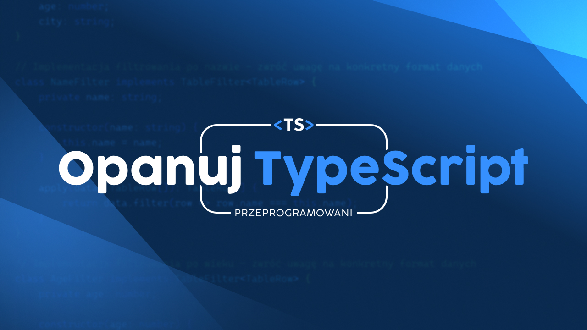

# Zaawansowany TypeScript w praktyce: Refaktoryzacja projektu React



W tym repozytorium znajdziesz kod źródłowy do odcinka ["Zaawansowany TypeScript w praktyce: Refaktoryzacja projektu React"](https://youtu.be/FVCwnjvNtUE) z serii ["Opanuj TypeScript"](https://opanujtypescript.pl) na kanale [Przeprogramowani](https://www.youtube.com/Przeprogramowani).

Kod po refaktoryzacji znajdziesz na branchu "after".

## Jak uruchomić projekt?

```
npm install
npm run dev
```

## Materiały pomocnicze

- [Ebook: Typy generyczne w TypeScript](https://opanujtypescript.pl/ebook/typy-generyczne-typescript)

## Wyzwanie "Advanced Filtering"

W repozytorium [przeprogramowani/typescript-challenges](https://github.com/przeprogramowani/typescript-challenges) znajdziesz wyzwanie, które pozwoli Ci przećwiczyć wiedzę zdobytą w tym odcinku.
